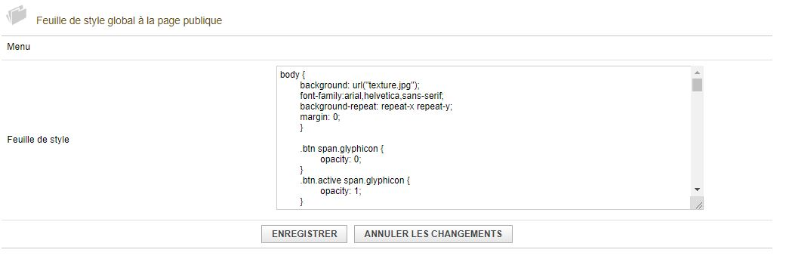

# Operation

The public pages of the module are broken down into several functionalities allowing the user to perform numerous tasks. You can configure these features via the administration panel, in "Public page management". You will therefore find information to help you with the module settings, then explanations of the content displayed in the public pages.

## Administration panels

### Store management

1) Activate the store: Allows you to activate or deactivate the purchase of objects via the public page

2) Text displayed before the product list: Displays a text describing the products sold in the shop

3) Link to the T & Cs: If a link is entered, the user must validate these T & Cs to be able to confirm the purchase

4) Link to the CGV: If a link is entered, the user must validate these CGV to be able to confirm the purchase

## Shop mail

These fields allow you to configure the content of the email that will be sent when purchasing a product on the store. The email may contain a link to validate the payment on paypal or on Stripe or to download the invoice.

## Behaviour

1) Activate the public page: Allows you to completely deactivate the public page, the store, the account creation, the registration page and public access to the user's account.

2) Display the navigation bar: Allows you to implement a customizable field to insert a navigation bar.

3) Display the number of registered in place of the number of places available: Change the display of the number of places, Example: 2/5 places available = 3/5 people registered on the total number defined.

4) Blocking registrations / Unsubscribing: Prevents a user from registering or unsubscribing X hour (s) before the event.

## Account creation

1) Activate public account creation: Allows you to activate or deactivate the possibility for non-registered users to register, via the public page by creating a user account.

2) Fields 1st, 2nd, 3rd page: Allow to personalize the message displayed at each stage of the registration.

## Style Sheet

This menu allows you to edit the style sheet in order to personalize the display of the public page menus.

## Content of the public page

These menus allow you to modify the content of the public page

1) Header text: Displays a logo, a title on the page

2) Navigation bar: Allows you to insert intermediate content between the header and the content of the page, most often a navigation bar

3) Page content: Allows you to modify the content present before the registrations are displayed.

4) Footer text: Allows you to modify the text present at the bottom of the page.

5) URL in the footer: Allows you to configure the site URL (Site to which the user will be directed if the pages are deactivated.)

## Management of reminders

These parameters are used to configure the sending of follow-up emails, these emails allowing the sending of a reminder email to the registered or invited user.

# View of the public page

When you are a user, you can access this information:

## Shop

After accepting the CGU & CGV, and selecting an article, we access the confirmation of our purchase.

## Confirmed Purchase

! [Eventh] (img / EventBoutiqueAchatUserView.JPG)

Click on confirm the order to access the payment interface.

## Navigation menus

### Administrator

When you are an administrator, you have access to the administration panel (ADMIN), to reservations and to logout.

An administrator is not afraid to use the store and buy credits for himself.

He cannot register for his own courses either.

### User

A user does not have access to the administration panel.

However, he can access the store

### Not enrolled

! [Eventy] (img / EventPanelLogoutView.JPG)

A user who is not logged in can only log in or create their account.

## My account - List of invoices

This page provides access to the list of validated invoices.

## Footer - Footer

This is the content of the footer that you can modify to adapt it to your graphic charter.

## Header - Header

This is the content of the header that you can modify to adapt it to your graphic charter.

## My account - History

This is the history of the courses in which the User has participated.

## Registration

### Administrator

An administrator cannot register for a course.

### User

The user can subscribe and unsubscribe via this interface (one subscription or one unsubscription at a time).

## Account creation

### First page :

All of these fields must be completed in order to access the second stage of registration.

### Second step :

This step allows the user to choose a password. It can log in with the generated identifier or with the email address.

### Third step :

When registration is complete, a message is displayed and the user is invited to log on.

## Registration - My account:

### User

This displays the number of user units, the cost of the courses to which the user registers, and a link to access the account.

### Administrator

The Administrator does not have access to the course registration, he can only access the course information.
